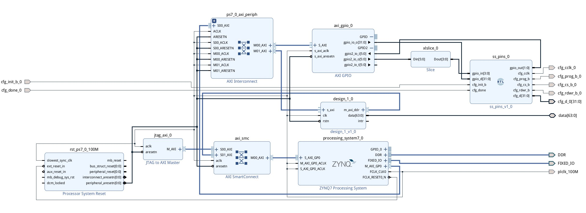

# ss_blast
Loading bitstream via Slave SelectMAP 32-bit via ZYNQ AXI GPIO. 

See XAPPS583 for protocol details. 

Block design used in this demo: 

One debugging hint: check `REGISTER -> CONFIG_STATUS -> BIT25_CFG_BUS_WIDTH_DETECTION` in Vivado hardware manager, 11 means 32-bit width detected. Also https://docs.xilinx.com/r/en-US/ug570_7Series_Config/Bus-Width-Auto-Detection for bus detection pattern.  

